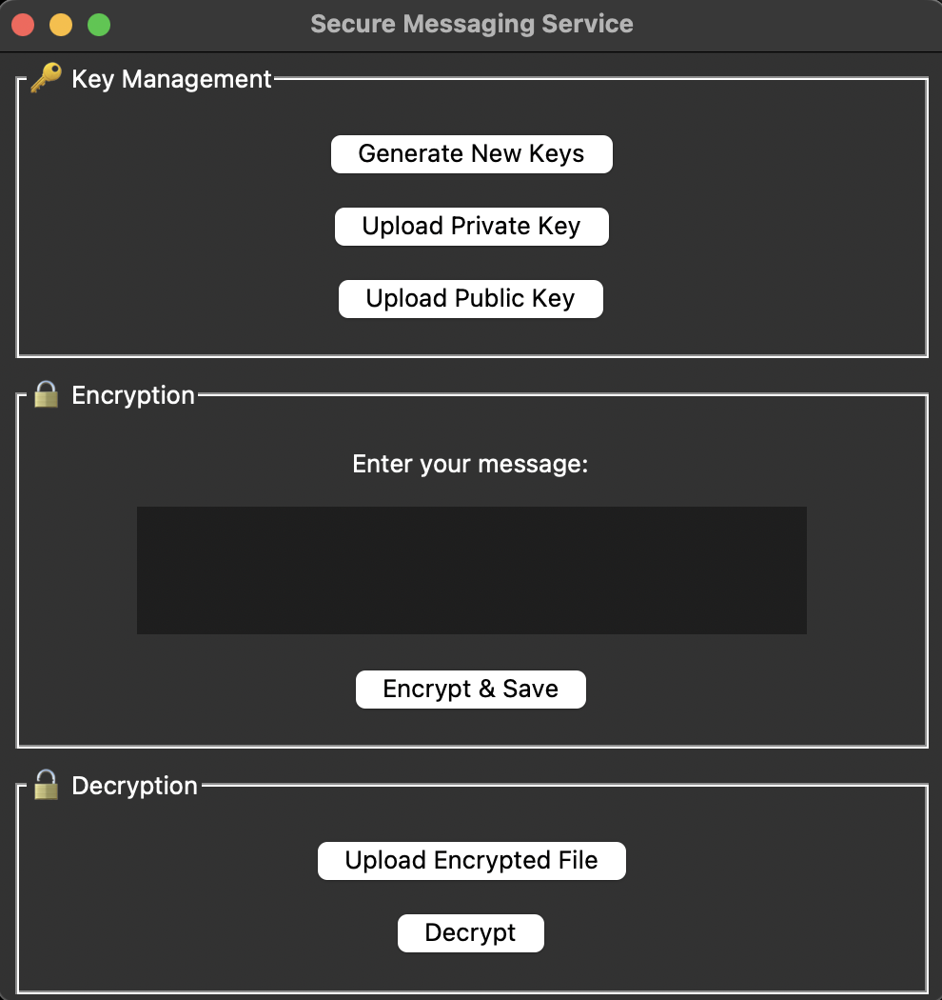

# Secure Messaging Service

A simple yet secure RSA-based encryption and decryption tool for text messages. The application allows users to generate or upload cryptographic keys, encrypt messages, and decrypt messages using a private key.

## Table of Contents

- Business & Product Understanding
- Coding & Statistics
- Features
- Installation
- Usage
- Security Considerations
- Future Improvements
- License

<p align="center">

</p>

## Business & Product Understanding

**Why This Application?** 
In an era of increasing digital surveillance and cyber threats, users require a simple yet effective way to securely communicate sensitive information. Our application provides a user-friendly interface for:
- Individuals & Businesses: Securely share messages without worrying about unauthorized access.
- Researchers & Developers: Experiment with RSA-based encryption and understand cryptographic workflows.
- Privacy-Conscious Users: Avoid third-party services by encrypting messages locally.

**Product Use Cases**
- Secure Communication: Encrypt confidential messages before sharing via email or cloud storage.
- Data Protection: Ensure that only intended recipients can decrypt messages.
- Research & Learning: Understand encryption principles hands-on with RSA key pair management.

## Coding

### Technical Overview
This application is built using:

- Python (Tkinter for UI): Provides a simple and intuitive graphical interface.
- Cryptography Library: Implements RSA encryption and decryption.
- File Handling: Saves and loads keys and encrypted files securely.

### Algorithm Statistics & Security
- RSA Key Size: 2048 bits (Recommended for moderate security needs).
- Encryption Algorithm: RSA-OAEP (Optimal Asymmetric Encryption Padding) with SHA-256 hashing.
- Decryption: Uses the private key for message retrieval.
- Key Storage: Users can generate new keys or upload existing key pairs.

## Features

**Key Management**

- Generate new public/private key pairs.
- Upload existing keys.
**Encryption**

- Encrypt messages using a public key.
- Save encrypted messages securely.
**Decryption**

- Upload encrypted files for decryption.
- Use a private key to decrypt messages securely.
**User-Friendly GUI**

- Simple and intuitive interface.
- Error handling for missing keys and files.

## Installation

Clone the Repository
```bash
git clone https://github.com/hemangsharma/SecureMessagingApp.git
cd SecureMessagingApp
```
Install Dependencies
```bash
pip install cryptography
```
Run the Application
```bash
python secure_messaging.py
```

## Usage

- Key Management
Click "Generate New Keys" to create a new key pair.
Or upload existing keys using the "Upload Private Key" and "Upload Public Key" buttons.
- Encrypt a Message
Enter a message in the text box.
Click "Encrypt & Save" to encrypt and store the message securely.
- Decrypt a Message
Upload the encrypted file.
Click "Decrypt" to retrieve the original message.

## Security Considerations

- Private Key Protection: Never share your private key with anyone.
- Key Size & Strength: The application uses a 2048-bit RSA key, but for highly sensitive communication, 4096-bit keys are recommended.
- File Security: Always store encrypted files in a safe location.
- No Cloud Storage: This tool runs entirely on your local machine, avoiding third-party vulnerabilities.

## Future Improvements

- AES Hybrid Encryption: Encrypt messages with AES and use RSA for key exchange.
- Support for Multiple Key Formats: Allow import/export of keys in PGP format.
- Cross-Platform Support: Package the app for Windows, macOS, and Linux.
- End-to-End Encrypted Chat: Extend the app to support real-time encrypted messaging.

## License

This project is open-source under the MIT License. Feel free to modify and use it for your own secure communication needs.
